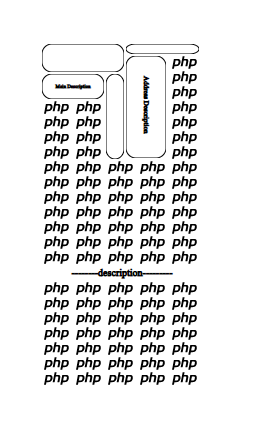

#php-svg

[](https://travis-ci.org/meyfa/php-svg)
[](https://codeclimate.com/github/meyfa/php-svg)


---

## How it works?
I developed this project using the meyfa/php-svg framework.
That framework is very good to mutation the SVG file.
Thanks for that. 




## Installation

### Composer (recommended)

This package is available through Composer/Packagist:

```
$ composer require meyfa/php-svg
```

### Manual

[Download](https://github.com/meyfa/php-svg/zipball/master) this repo,
or the [latest release](https://github.com/meyfa/php-svg/releases),
and put it somewhere in your project. Then do:

```php
<?php
require_once __DIR__.'/php-svg-master/autoloader.php';
```

The rest works exactly the same as with Composer, just without things like nice
version management.
